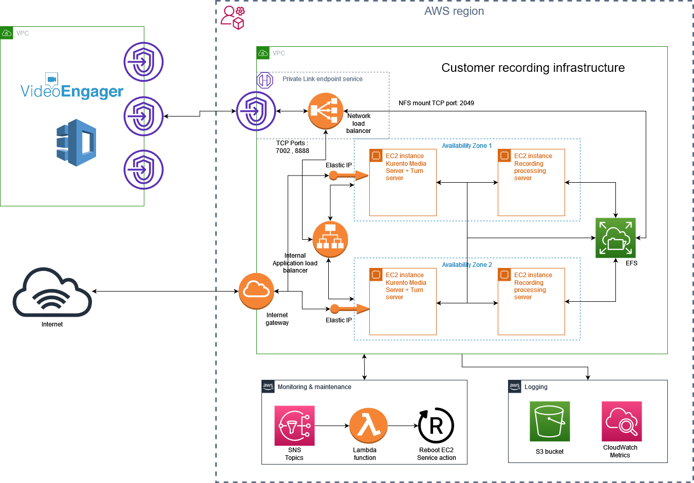
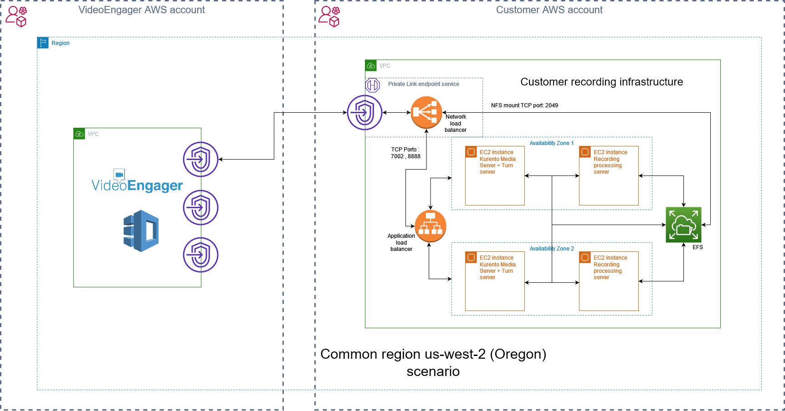
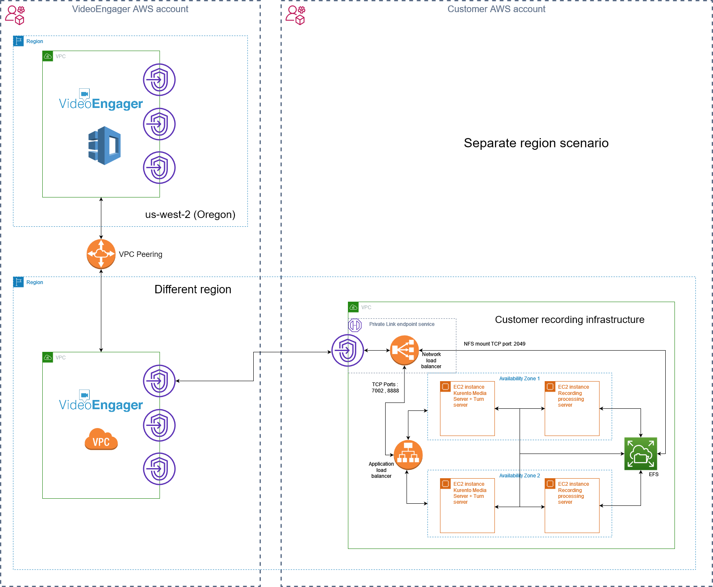
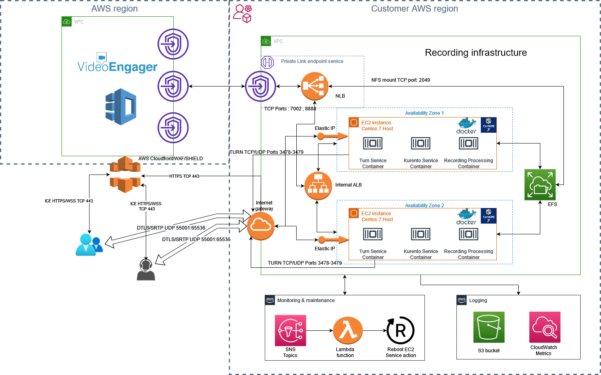

# Recording Infrastructure Deployment

## Basic info

This repo will deploy recording infrastructure w/ elastic IP address for Kurento Media Servers. Recording infrastructure's basic building blocks are:
* application load balancer with sticky sessions
* Kurento Workers, being an EC2 compute node
* Processing Workers, being another EC2 compute node,
* EFS, representing a storage element
* VPC and VPC peering to VideoEngager's controlling and signalling infrastructure.
* PrivateLink endpoint service to VideoEngager's controlling and signalling infrastructure.
* Docker containers instead of separate EC2 instances scenario

A high-level diagram is available [here](https://help.videoengager.com/hc/en-us/articles/360049346572-Recording-)




A high-level diagrams for common AWS region PrivateLink scenario :




A high-level diagrams for separate AWS region PrivateLink scenario :




A high-level diagrams for Docker workers usage scenario :




Both, Kurento and Processing workers are EC2 containers that are initialized from AMIs, baked by VideoEngager. For more information about these AMIs, one can refer to the [following repository](https://github.com/VideoEngager/recording-golden-amis)


## Step-by-step, first-time deployment

1. Before you start please make sure [Terraform](https://www.terraform.io) is installed on your machine or on the machine you will use to execute repo scripts from. If you still do not have Terraform, pls install it. It is available for multiple OS. [Here is a guide](https://learn.hashicorp.com/terraform/getting-started/install.html) on how to install.

2. Open ```inputs.auto.tfvars``` file and fill parameters
    > By default comunication with Videoengager VPC is by VPC peering. If you want to use AWS PrivateLink , set variable ```use_private_link = true```

    ##
    
    > For Docker workers scenario set these variables :
    >> *  ```use_docker_workers = true```
    >> *  ```aws_ecr_docker_token = "<token>"``` : This token is provided by Videoengager and is valid 12 hours! 

   ##

     > If need to save state in [terraform cloud](https://cloud.hashicorp.com/products/terraform) please rename file ```remote-state.tf.disabled``` to ```remote-state.tf``` and fill your *organization* and *workspace* fields. 
    
    > Next step is to login in terraform cloud with command
    ```bash
    terraform login
    ```

    

3. From the project root directory, type:

```bash
terraform init
```

4. To review deployment plan run

```bash
terraform plan
```

5. If you are happy w/ plan, ou can go ahead and deploy by running the following command:

```bash
terraform apply -auto-approve
```

## Update procedure

When you need to update your recording infrastructure do following :

1. Be sure that the state of you infrastructure is available : 
   
   * In case you are using terraform.tfstate file : File should be in the root script directory

   * In case you are using terraform cloud : 

     * Check login with : 
      ```bash
      terraform login
      ```
       
     * Reinit state with :
      ```bash
      terraform init -reconfigure
      ```

2. Run Update commands :
  
  * In case you are using EC2 containers : 
  ```bash
  terraform plan
  terraform apply
  ```
  * In case you are using Docker containers :
    * Check value of `nodes_count` variable located in `inputs.auto.tfvars` and execute following :
      * In case nodes_count=2 
      ```bash
      terraform plan -replace=aws_instance.docker_worker[0] -replace=aws_instance.docker_worker[1]
      terraform apply -replace=aws_instance.docker_worker[0] -replace=aws_instance.docker_worker[1]
      ```
      * In case nodes_count=3 
      ```bash
      terraform plan -replace=aws_instance.docker_worker[0] -replace=aws_instance.docker_worker[1] -replace=aws_instance.docker_worker[2]
      terraform apply -replace=aws_instance.docker_worker[0] -replace=aws_instance.docker_worker[1] -replace=aws_instance.docker_worker[2]
      ```
    
    Or just append needed `-replace aws_instance.docker_worker[?]` block to the terraform plan/apply 
